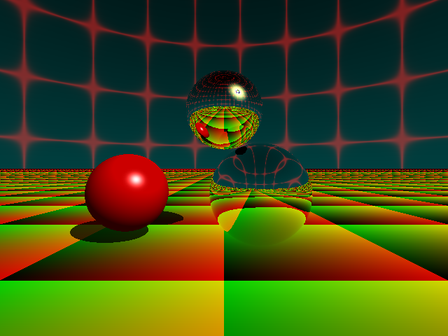

# Ray-rust

A very simple Rust implementation of ray tracing renderer.

## Output example

## Usage

    ray-rust [width] [height] [-o output.png]

Defaults:

    width: 640
    height: 480
    output: foo.png
